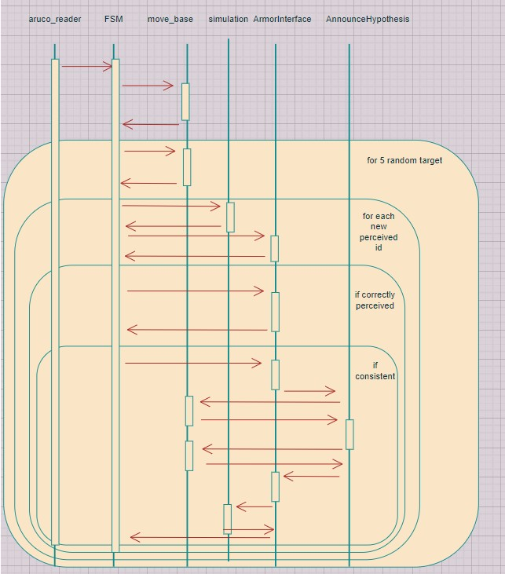

# Experimental Robotics Laboratory - Assignment3

This assignment is the third version of the autonomous Cluedo game. In that case the robot should explore an apartment and look for aruco. These, once detected, retrieve a specific id. Each id is associated to an hint used to reason about a possible solution of the game. The robot goes on in looking for hint since the correct hypothesis is found. In that case the aim of the assignment is implement/use a proper navigation algorithm to find aruco and use cv_bridge and the aruco library in order to collect and detect  hints.

## Software Architecture

### Robot Model

**sherlock_robot.gazebo** and **sherlock_robot.xacro** files in the urdf folder contains the model of the used robot.
Moreover the robot has a derivative controller. It is equipped with two cameras one at heigth of 0.5m pointing in front of the robot and the other pointing at the floor. Moreover the robot is equipped of lasers. More specifications about the robot model are inseted in the following paragraphs.

### Robot behavior 

The robot behavior is organized as follow. The robot reach the centre of the room, reach five randomly chosen targets inside that room, once a target is reached it rotates around itself. Then it passes to the next room, once all the rooms are visited it starts again from the first room. It continously look for aruco subcribing to the cameras' topic. When a new hint is perceived it interfaces with armor to reason about that hint. I think that in that case the state diagram is useless since different components are active at the same time and there is not a well defined transition between behaviors. Detect hint behaviors and Navigation one for example are always concurrent.

### ROS nodes

* **ArmorInterface.py** implements the of **/armor_interface** service. It is used in interface with **armor**. It can interact in four modality load the ontology, check the hypothesis is correct, check if there is a new consistent hypothesis and add a new hint to the ontology once it has been perceived. In the folder is present the ontology **cluedo_ontology.owl**. Moreover a new inference ontology is saved once the game terminatein **cluedo_ontology_inference.owl**.

* **AnnounceHypotesis.py** it is the server of **/announcement** service. It is called for announcing to the oracle the new consistent hypothesis.

* **FSM.py** is a finite state machine which synchronize the whole simulation. It is an action client of **move_base** and a publisher of **/cmd_vel**. Hence, it menage the whole navigation module. Moreover in order to perceive id it subscribes to **aruco_id** topic, once perceived it send the id as request to **/oracle_hint** service and retrieve as response the hint corresponding to that id.  Moreover is a service client of **/armor_interface** service and call it when a new hint is perceived. If the hint is perceived correctly it call it to check if there is a new consistent hypothesis, if true it call it again to check if it is also correct.

* **aruco_reader.cpp** it is a node of **aruco_ros_assignment** package used to perceived and detect the aruco. The id of the detected aruco are published on **aruco_id** topic as **std_msgs/Int64**.

* **simulation.cpp** is an already implemented node. It is the server of **/oracle_hint** service, it takes as request an id and respond with an hint which can be correctly perceived or malformed. Moreover it is the Oracle which responds if the hypothesis to check is correct or not. 

The component diagram shows the modularity of this architecture and how the main functionalities are well separated among components. At centre is well visible **FSM.py** node which menages the whole simulation. In the component diagram in the action communication protocol the feedback channel it is not represented for simplify the diagram since it is never used. The role of each node and their connections is explained above.

The sequence diagram shows how the nodes communicate each time the robot enter in the new room. It is clear how the centre of the whole simulation is **FSM.py** since it synchronize it selfs with other nodes with service/client communication protocol or action server/action client one. It always listen for a new id. It calls **move_base** to reach the room. For five time it calls **move_base** to reach a random target. Once reached if it has perceived an hint it before ask to **/oracle_hint** service the associated hint then starts interface with **ArmorInterface.py**. This last node to check the correct hypothesis call **/announcement** and **/oracle_solution** services. 

### Defined costume Services

* **ArmorInterface.srv** it is a service with as request the **mode** in which the client wants to interface with armor: 0 to load the ontology, 1 to check correct, 2 to check consistency, 3 to perceive an hint.
 Another request field is characterized by the perceived hint so the **ID**, the **key** and the **value**.

 The response is characterized by the **mode** and the **ID** as above, moreover is present the **success** field that it is true if the action has been correctly concluded. For example it is false when is performed a malformed hint, when there isn't new consistent hypothesis or when the checked hypothesis is uncorrect.
 
* **Announcement.srv** has as request the **who**, **what** and **where** fields of the hypothesis to announce. The response is a boolean **success** to state is the service has been correctly concluded.

### Parameters

All the parameters defined are inside the **gamesession.yaml** file in the **config** folder.
* **current_hypotesis** is used to state the current consistent hypotesis to check.
* **curr_ID** contains only the id of the current hypothesis.
* **ontology** and **ontology_path** contain the link and the path used to load the ontology.
* **actual_location** is a parameter used to store the actual room of the robot.

## Requirements
The ROS packages needded to compile the code are:
* [armor](https://github.com/EmaroLab/armor)
* [planning](https://github.com/CarmineD8/planning)
* [erl2](https://github.com/CarmineD8/erl2)
* [aruco](https://github.com/pal-robotics/aruco_ros/tree/noetic-devel/aruco)
* [aruco_msgs](https://github.com/pal-robotics/aruco_ros/tree/noetic-devel/aruco_msgs)

## How to compile the code

Clone [erl3_aruco](https://github.com/AliceNardelli/erl3_aruco) repository.
Copy the **markers** folder inside the **.gazebo** folder inside the **root**.
Build the workspace:

> catkin_make -DCATKIN_WHITELIST_PACKAGES=""

Load the aRMOR (remember that the rosmaster must running):

> rosrun armor execute it.emarolab.armor.ARMORMainService

Run the overall simulation:

> roslaunch erl3_assignment simulation.launch

> roslaunch erl3_assignment gazebo4.launch

> roslaunch erl3_assignment Cluedo_game.launch

## Running code
Here are present two different screenshots of the shell during the exploration of the environment.
Moreover a video is available in the folder, it represent the exploration of the first room.

## Working hypothesis and environment

### System's features
* The overall architecture has been design in order to be as modular as possible. In particular my main idea is to semplify the overall system in order to have a single module devoted to each important topic: navigation, aruco detection and ontology. Moreover I have decided to give more importance to have a simple, well structured and working code. This architecture give me the possibility to test the whole code. This is important because the end of the game if there are too many hints is difficult to reach.
* The robot model has ben chosen in such a way to have a camera pointing on the floor and another pointing in front of it at height of 0.5 between the height of the hint (floor and 1m). 
* Aruco detection is implemented by **aruco_reader** of **aruco_ros_assignment** package. In particular this node read a ROS image from **/robot/camera1/image_raw** and **/robot/camera2/image_raw** topics, convert in in a openCV image using the **cv_bridge** and detect the aruco id using the aruco library. Moreover when the subscriber reads the data from the devoted topic the image transport is used. The image transport allows to transport the image in low-bandwidth compressed format. So it is used for reduce the consume of resources. An instance is generated and used to declare publishers and subscribers to a certain topic. In that case only a subscriber for each camera is used. A publischer of **/aruco_id** topic has been added in order to communicate the id of the perceived topic. In that case a **std_msgs/Int64** message has been used.
The robot doesn't distinguish if the aruco are detected on the floor or on the wall since there is not need of distinguish the two behaviours. According to that only one single topic **/aruco_id** is used for both the camera.
* The robot is equipped with laser which are foundamental for reactive navigation.
* The mapping of the environment is done through **Gmapping (FastSLAM)** . In order to use this algorithm it is necessary a robot with laser and odometry. In order to localize the robot and to build the map the gmapping subscribes data from **/tf** and **/scan**. The localization is done computing the tree of frames with respect to the map frame. The requirements of the robot are laser, odom link and base link. In that case the base link is **link_chassis**.
* As PathPlanning **Move_base** approach has been used. It consists in a reactive-deliberative navigation. It has at same time local gand global planner. For the global planner I have firstly tryed both Dijkstra's algorithm. Then I have substituted it with the A* which has not a breadth first approch as Dijkstra's algorithm but consider an heuristic for searching. It generally find the solution in a faster way and less compute demanding.
This is possible changing the **base_global_planner** parameter in **move_base.launch** with value **global_planner/GlobalPlanner**.
For the reactive part in particular it uses sensors and odometry.
* The robot explores goes at the centre of each room using move base. Than it rotates, then for five times in goes to a random target using move base and once arrived it  rotates. When it has reach a target and it has found an hint it stops for querying the ontology.
* In the randomly exploring room behaviour the robot uses **Move_base** since the apartment is quite complex and the random target can be generated near walls. Maybe the use going in a straight way to the target is the faster solution but the chosen one assures safety.
* The communication protocol more used in the overall architecture are the service and the action as in the previous assignment to handle with the reasoning module.
In that case the publisher subscriber communication protocol is used for perception and execution. In particular the reactive navigation use laser data an the aruco detection use the camera data which are both characterized by a pub/sub.
* The whole game is model based. The ontology is the model of the game. It allows to instantiated as A-box the hints found by the robot and store it in the corresponding classes: PERSON, PLACE and WEAPON. Moreover it allows to reason about the hypothesis. 
The hypotesis belong to the COMPLETE class if they has at least one PERSON, one WEAPON and one PLACE, they belong also to the UNCONSISTENT class if they have more than one PERSON or PLACE or WEAPON. Consequently the consistent hypotesis are the ones that has only one entity for each hint class and they are the ones which belong to the COMPLETE class and not to the UNCOSISTENT one.
The INCORRECT class has been added to the ontology and has as instances all the hypothesis already checked as not-correct. This choice has been done in order to not add hint belonging to uncorrect hypotesis and not check and announce their id more than once.
* **simulation.cpp** node implement the oracle. It give as service response the hint associated to a specific ID and the correct the ID of the correct hypotesis.
* The announcement is done via a print on the shell. In orer to announce the actual consistent hypothesis the robot reach the centre of the arena through **move_base** then it returns where it was.

### System's limitations and Possible technical Improvements 
* The first limitation is the robot model. The first limitation is that cameras are not attached to the physical model. A possibility is used an already modeled robot. Another possibility is to play with primitive shapes. It is really simple to add a cuboid on the link chassis and position above another perpendicular link. Then the camera will be positioned one above the two links and the other at bottom of the perpendicular one. I have tryed this possibility and the overall result was really ugly so I preferred live the thing as are now. Another possibility was using a robot with one arm and one camera, and position the camera moving the arm through moveit as in the second assignment. The biggest difficulty of this choice refers to the searching aruco algorithm. If I don't know where aruco are a priori for each pose of the robot I have to random positione also the arm in order to find the aruco. It is simpler to have fixed camera and only move randomly the base of the robot.
* It is possible to have two camera pointing at front of the robot one at 1m and one on the floor. I think it is too resources consuming and useless since the camera has a large field of view and the aruco are detected also from far. For a more precise search it is possible also one detected an aruco to get closer it, I think it is foundamental in case of distortions in a real environment scenario. For simplicity and computational reasons I have decided to look at aruco from far and use only one camera at 0.5m.
* For saving resources has been decided to not add the publisher of the processed image on different topics, the code has been implemented and is present in **aruco_reader.cpp**. I have decided to argument it becase it slows too much the simulation. Logically it is possible to consider further immage processing.
* A possible improvements with seraching algorithm is playing also with pan angle of the camera and move less the robot. I have preferred only to focus on the navigation.
* Certainly for an optimal plan using ROS_plan instead of a simple finite state machine is a better solution. Since I have already used ROS_plan in the second assignment is not difficult to add it on the software. I have preferred to simplify the architecture as much as possible in order to focus only on the new topics.
* There is a limitation in the navigation algorithm. When the robot is in proximity of a goal it blocks for few seconds. I didn't understand the reason, I have added a timeout when I call the **move_base** action server and modified the **xy_goal_tolerance** in **base_local_planner_params.yaml** of the **planning** package. I don't understand if these changes improves the performances of the robot.
* In that specific case the dimension of the room is not considered but the target are randomly generated in a distance of 1.5m from the centre of the room. A possible improvement is to explore the reading the distance of the wall of the room from the laser, maybe make the robot reaches it with a certain orientation, and make the robot explore the environment according to that distance. 
* A possible error is that a random target is generated out of the room, but since the **move_base** uses the obstacle avoidance this is not a big matter. Then anyway the next target will be generated inside the room.
* In that case the robot randomly reaches 5 poses for room. It doesn't metter if find all the aruco of the room, after 5 random motions it changes room. A possible improvement is to make perceives all the 5 aruco before leaving it. Since the navigation modules give me troubles I have firstly implemented this solution but the robot stay too much time inside the room without exit.
* A possible improvement of the system is to divide the system in two different behaviors, in the first one the robot should explore randomly the environment in order to find the aruco. Once the aruco are find the (x,y) coordinates in which the robot are associated to the id of the hint. Once that all hints are found the second behaviors start and the robot goes directly on the specific position to perceive again the hints. Certainly this type of search is more sistematic.
* Sometimes the robot perceive an id not correctly. The solution in that case should be each time an aruco is perceived the robot should go near the aruco to perceive it again. I simply added a check on the id. If the id is not between 11 and 40 it will be perceived as an uncorrect hint.
* To conclude I think that the overall result is quite good. The bigger and most evident problem is the slowness of the robot during the navigation. There are lots of possible improvements.

###  Authors and contacts 
Alice Nardelli
alice.nardelli98@gmail.com

